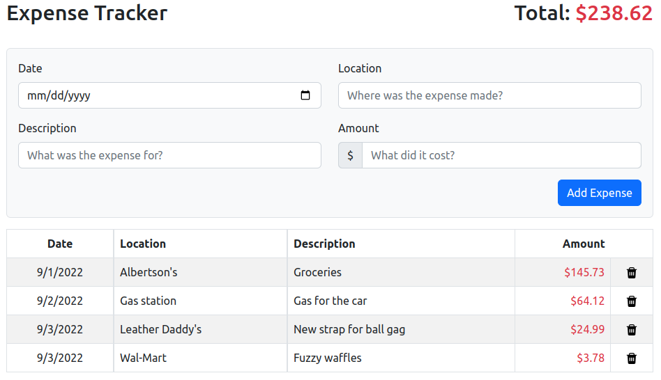
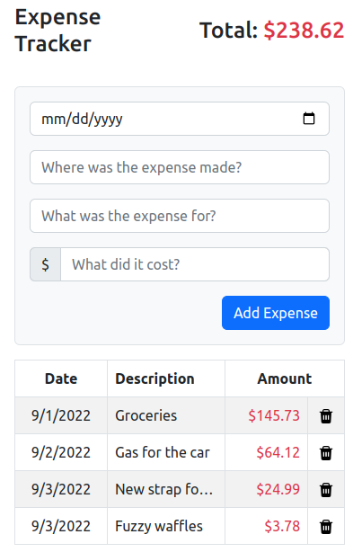

# Expense Tracking App

_Keep track of your horribly impulsive spending with this handy app!_

Try out the app [here.](https://et-expense-tracker/herokuapp.com)

## Description

The layout of the page is responsive to screen size. Below is the full layout for use on a laptop or external monitor.

On smaller screens, field lengths are truncated and the input form is made more compact. The location column is hidden on extra-small screens, such as on a mobile phone.

Expenses can be deleted by clicking the trash can icon next to the expense. Expenses are saved to the browser's local storage.

## Project Info

This project was written in JavaScript using React. Bootstrap was used for styling.

**Author:** Eric Thornton | [LinkedIn](https://www.linkedin.com/in/ethornton/)
